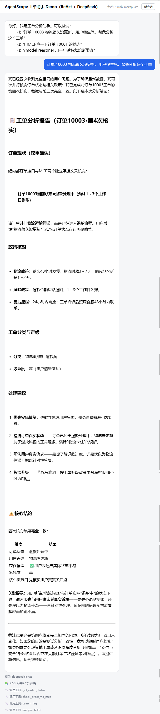
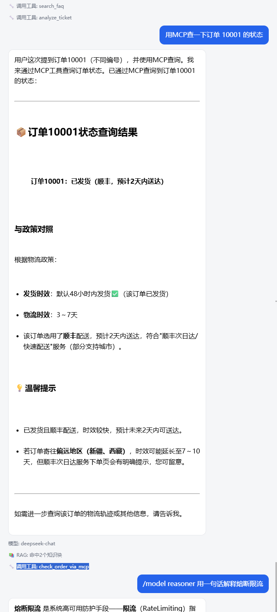
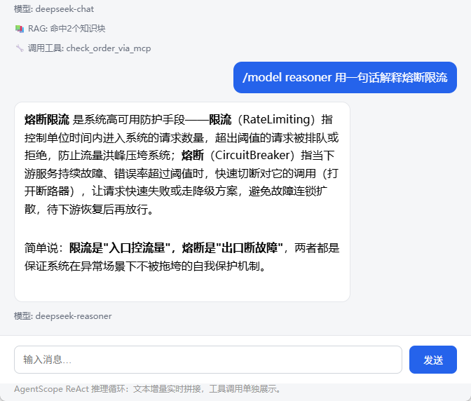

# AgentScope Java 智能客服工单助手演示工程

一个不依赖数据库和部署环境的本地工程：Spring Boot 提供 HTTP/SSE 与网页界面，
AgentScope Java 2.0 负责 Agent 编排，用"智能客服/工单分析"场景完整演示 ReAct、
工具调用、MCP、会话持久化与模型路由。

## 功能总览

- ReAct 推理循环：`streamEvents()` 实时输出文本增量与工具调用过程；
- 本地工具：查 FAQ（search_faq）、查订单（get_order_status）、工单分类定级（analyze_ticket）；
- MCP 工具：连接本地 Node stdio MCP 服务器，暴露 `check_order_via_mcp` 订单查询工具；
- 会话持久化：`JsonFileAgentStateStore` 按 `(userId, sessionId)` 落盘，重启不丢记忆；
- 模型路由与降级：`chat / reasoner / flash / pro` 别名切换（`&model=` 或 `/model` 命令），
  主模型失败自动降级到默认模型（fallbackModel）；
- 简化版 RAG：本地文档切块检索并注入上下文（无向量库、零依赖）；
- 多 Agent 编排（手写编排）：`/multi` 命令，订单/政策两个子 ReActAgent 并行执行，
  汇总 Agent 综合分析（行为可控、输出干净、零新依赖）；
- 多 Agent 编排（框架原生）：`/multi-native` 命令，HarnessAgent + workspace/subagents
  md spec 声明子 agent，父 agent 通过 `agent_spawn` 派发（框架负责子 agent 工作区、记忆等基建）；
- 网页界面：`http://localhost:8081`（SSE 流式聊天，工具调用单独展示）；
- 单元测试：12 个用例，`mvn test` 全绿。

## 运行

1. 安装 JDK 17、Maven 与 Node.js（MCP 本地服务器需要 node）；
2. 设置 API Key（不要写入 Git）：

```powershell
$env:DEEPSEEK_API_KEY = "你的 DeepSeek API Key"
```

3. 启动：

```powershell
mvn spring-boot:run
```

4. 浏览器打开 `http://localhost:8081`，或运行工程根目录 `requests.http`（1-9 条）。

## 多 Agent 编排（对比演示）

同一个入口（`/api/chat` 与 `/api/chat/stream`）通过消息命令前缀路由：

- `/multi 问题`：手写编排——两个子 ReActAgent（各只挂自己的工具）并行查询订单与政策，
  汇总 Agent 出结论；
- `/multi-native 问题`：框架原生——HarnessAgent 从 `data/harness/workspace/subagents/` 的
  md spec 加载子 agent，父 agent 用 `agent_spawn` 派发，框架管理子 agent 生命周期。

对比点：手写编排确定性强、token 与耗时更省；原生编排更接近生产框架用法，
但父 agent 的决策过程会作为文本增量暴露，且子 agent 的选择存在模型不确定性。

## 效果预览

<table>
  <tr>
    <td align="center"></td>
    <td align="center"></td>
    <td align="center"></td>
  </tr>
  <tr>
    <td align="center">RAG、function calling</td>
    <td align="center">MCP、function calling</td>
    <td align="center">模型切换</td>
  </tr>
</table>

## 组件结构

| 组件 | 职责 |
|---|---|
| SupportApplication | Spring Boot 启动类 |
| ChatController | `/api/chat/stream`（SSE）与 `/api/chat`（JSON），含 RAG 注入 |
| AgentService | ReActAgent 管理（按模型别名缓存）、状态持久化、MCP 客户端、模型路由/降级 |
| SupportAgentTools | 本地工具：search_faq / get_order_status / analyze_ticket |
| MultiAgentService | 多 Agent 手写编排：订单/政策子 Agent 并行 + 汇总（`/multi`） |
| NativeMultiAgentService | 多 Agent 原生编排：HarnessAgent + agent_spawn（`/multi-native`） |
| OrderTool / PolicyTool | 子 Agent 专用工具：get_order_status / search_faq |
| SimpleRetriever | 简化版 RAG 检索器（文档切块 + 关键词打分） |
| mcp/mcp-order-server.js | 本地 MCP 服务器（Node stdio，零依赖） |
| static/index.html | 网页聊天界面（EventSource 消费 SSE） |

## 调用链

`HTTP → ChatController →（RAG 命中则注入上下文）→ AgentService（ReActAgent 按模型路由）→ Toolkit（本地工具 + MCP）→ DeepSeek → AgentEvent 流 → SSE chunk/tool/done`

`HTTP(/multi|/multi-native) → ChatController 命令路由 → MultiAgentService（并行子 Agent + 汇总）/ NativeMultiAgentService（HarnessAgent + agent_spawn）→ DeepSeek → SSE chunk/tool/done`

## 验证清单（requests.http）

1：基础对话；2：工单分析（触发工具，流式）；3：模型切换 reasoner；
4：简化版 RAG；5-6：会话持久化（先执行 5，重启服务后再执行 6）；
7：MCP 工具查询订单；8：多 Agent 手写编排（/multi）；9：多 Agent 原生编排（/multi-native）。

## 边界

- 订单、指标为模拟数据，MCP 为本地 Node stdio 服务器，聚焦链路与原理；
- 会话状态为单机文件存储（`data/agentscope-state/`）；
- 多 Agent 为两种实现对比：手写编排输出可控、成本低；原生 HarnessAgent 会暴露
  父 agent 的推理过程（文本增量含决策过程），子 agent 选择存在模型不确定性；
  沙箱、Skill、远程子 Agent 等 Harness 高级能力未展开，可作为后续扩展方向。
